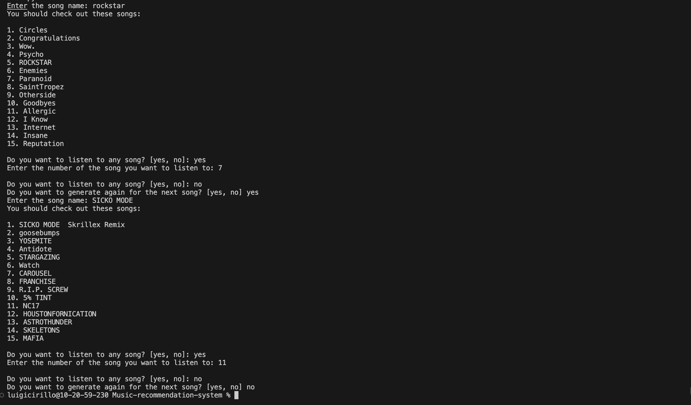
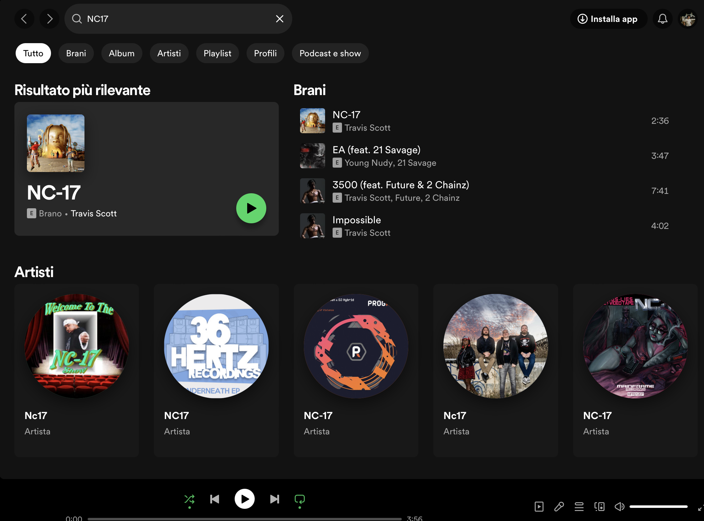
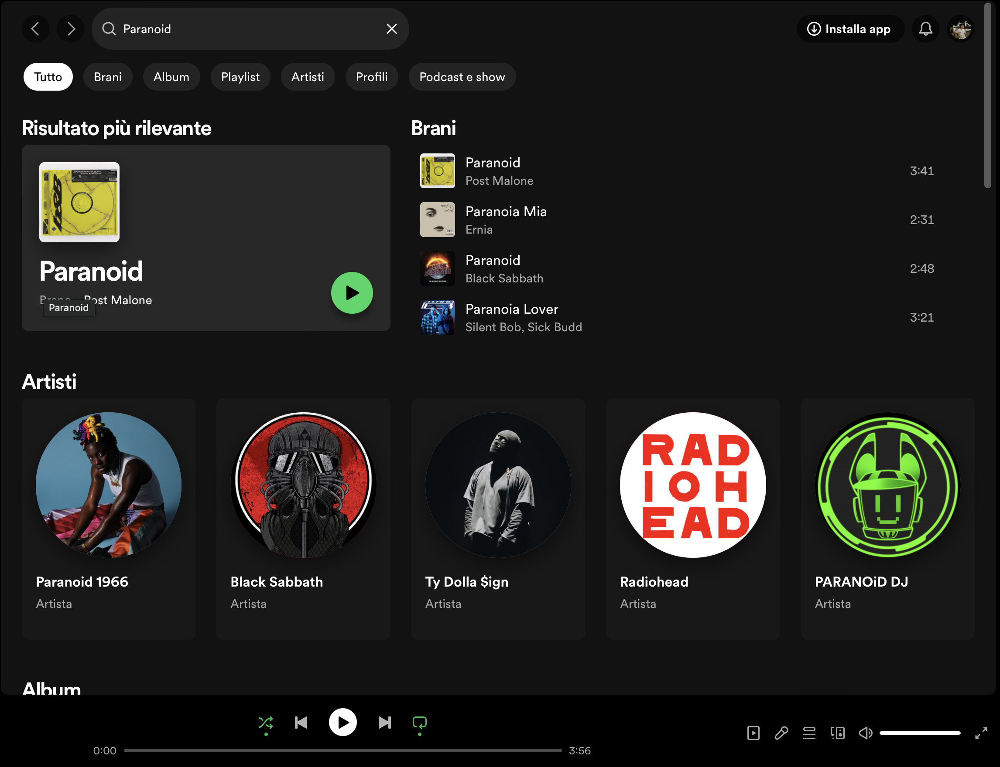

# Music Recommendation System with Content-Based Filtering

## Overview
Welcome to our Music Recommendation System based on content-based filtering! This system utilizes content-based filtering to recommend songs to users based on their preferences. Content-based filtering recommends items by comparing the content of the items to the user's profile. In the context of music, this means recommending songs similar to those the user has liked in the past.

## How Content-Based Filtering Works
Content-based filtering focuses on the characteristics of items and a profile of the user’s preferences. In our system, we create a profile for each song based on its features such as the artist, title, and other relevant information. We then recommend songs that are similar to the ones the user has liked, using a similarity metric.

## The Code Structure
The code is divided into several key sections, each serving a specific purpose.

### Data Preprocessing
- **Read and Clean Data:** The system starts by reading the music dataset, removing duplicates, and handling missing values.
- **Feature Engineering:** We extract relevant features such as the artist's name, song name, and concatenate them into a single column named "data." This column is used as the basis for building the recommendation system.
  ```python
  df = pd.read_csv("data/Spotify_final_dataset.csv", low_memory=False)
  df = df.drop_duplicates(subset="Song Name")
  df = df.dropna(axis=0)
  df = df.drop(df.columns[3:], axis=1)
  df["Artist Name"] = df["Artist Name"].str.replace(" ", "")
  df["data"] = df.apply(lambda value: " ".join(value.astype("str")), axis=1)
### Model Building
- **Vectorization with CountVectorizer:** CountVectorizer converts the text data into a matrix of word counts. In our case, it transforms song information into a matrix where each entry represents the count of a word (feature) in the dataset.
 ```python
vectorizer = CountVectorizer()
vectorized = vectorizer.fit_transform(df["data"])
```
- **Cosine Similarity:** Cosine similarity is used to calculate the similarity between songs based on their feature vectors. It measures the cosine of the angle between two vectors and produces a similarity matrix. Then we build a matrix where the rows and columns are the song names and the values are the cosine similarities.
```python
similarities = cosine_similarity(vectorized)
df_tmp = pd.DataFrame(similarities, columns=df["Song Name"], index=df["Song Name"]).reset_index()
```
### User Interaction
The system engages with the user through a command-line interface:
1. **Song Input:** The user provides the name of a song they like.
2. **Recommendation:** The system generates and displays a list of 15 songs most similar to the user's input.
 ```python
   song = input("Enter the song name: ")
        
        if song in df_tmp.columns:
            #create a new dataframe with the 15 most similar songs
            recommendation = df_tmp.nlargest(16, song)["Song Name"]
            break
        else:
            print("Song not found, please try again")
 ```
3. **Listen to a Song:** The user can choose to listen to a recommended song by entering its corresponding number. The system opens the Spotify link for the selected song.
   ```python
   try:
       song_number = int(input("Enter the number of the song you want to listen to: "))
       if 1 <= song_number <= len(recommendation) - 1:
           song_to_listen = recommendation.values[song_number]
           webbrowser.open(f'https://open.spotify.com/search/{song_to_listen.replace(" ", "%20")}')
       else:
           print("Invalid song number. Please enter a number within the range.")
   except ValueError:
       print("Invalid input. Please enter a valid number.")

### User Experience
- **Interactive Command-Line Interface:** The system guides the user through song input, recommendation display, and the option to listen to a recommended song.
- **Error Handling:** The system handles input errors gracefully, providing informative messages to guide the user.
      

## CountVectorizer and Cosine Similarity
### CountVectorizer
CountVectorizer is a feature extraction method that transforms text data into a matrix of word counts. It identifies unique words (features) in the dataset and represents each document (song) as a vector of word counts. This allows us to quantify the importance of each word in a song.

### Cosine Similarity
Cosine similarity measures the cosine of the angle between two vectors. In our system, it is used to calculate the similarity between song vectors. A higher cosine similarity indicates a greater similarity between songs. This metric is crucial for identifying songs that closely match the user's preferences.

## Running the System
Ensure you have the  following installed: `Python (3.6 or higher)`, `pip (Python package installer)`.
### Getting started 
1. **Clone the Repository:** Open a terminal or command prompt and run the following command to clone the repository to your local machine: 
``` bash
git clone https://github.com/GGCIRILLO/music-recommendation-system.git
```
Otherwise you can clone it using GitHub Desktop (or other apps) providing the link.
2. **Navigate to the Project Directory:** Change into the project directory: 
``` bash
cd music-recommendation-system
```
3. **Install Dependencies**: Run the following command to install the required Python dependencies:
``` bash
pip install -r requirements.txt
```
4. **Run the Recommendation System:** Execute the main Python script to run the Music Recommendation System:
``` bash
python main.py
```
Follow the prompts in the terminal to interact with the system. Enter the name of a song to receive personalized recommendations.
Feel free to customize the system, experiment with different songs, and discover new music tailored to your taste!
